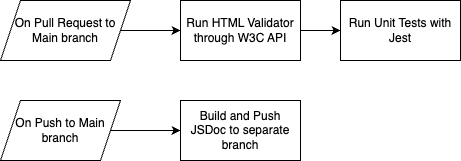

# Phase 1 pipeline:

## Current Pipeline

Our current pipeline currently runs 3 jobs in 2 workflow files:

- 1. HTML Validation (runs on pull request into main): Validates all .html files through the W3C HTML Validator API. The grep command finds errors in the output json file.

- 2. Unit Tests (runs on pull request into main): Runs all unit test files in test/ using the jest framework.

- 3. JSDoc (runs on push into main): Builds docs/ using the JSDoc library and pushes it to separate docs branch.

Diagram of current pipeline:

## Future Considerations

- 1. Implement additional validation for CSS and JS code

- 2. Implement automatic code formatting for JS code (with libraries like Prettier)

- 3. Automatic deployment of app to GitHub Pages
