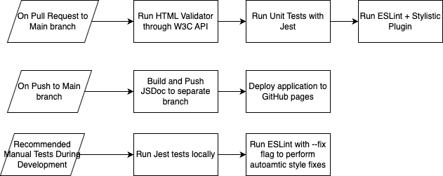

# Phase 2 pipeline:

## Current Pipeline

Our current pipeline currently runs 5 jobs in 3 workflow files:

- 1. HTML Validation (runs on pull request into main): Validates all .html files through the W3C HTML Validator API. The grep command finds errors in the output json file.

- 2. Unit Tests (runs on pull request into main): Runs all unit test files in test/ using the jest framework.

- 3. ESLint + Stylistic Plugin (runs on pull request into main): Runs linter according to eslint.config.js. Stylistic plugin to enforce stylistic consistency of code.

- 4. JSDoc (runs on push into main): Builds docs/ using the JSDoc library and pushes it to separate docs branch.

- 5. GitHub Pages Deployment (runs on push into main): WIP. The idea is to deploy our web application to github pages on each push into main.

Additional Quality of Life Features to Streamline Development/Deployment Include:

- Creation of HOW-TO-CONTRIBUTE.md to solidify team's development workflow and provide a guide/reference to the various parts of the project.

- Support and encouragement of local testing and linting to catch mistakes before pull requesting.

Diagram of current pipeline:

## Future Considerations

- 1. Perhaps have some action to manually build our project, making files smaller and more compact. The built version of our project, unlike during dev, does not have to be human-readable or pretty in any way.
